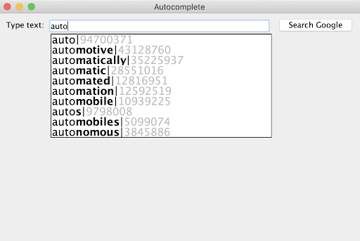

# Project 4: Autocomplete

This is the directions document for Project 4 Autocomplete in CompSci 201 at Duke University, Spring 2023. [This document details the workflow](https://coursework.cs.duke.edu/cs-201-spring-23/resources-201/-/blob/main/projectWorkflow.md) for downloading the starter code for the project, updating your code on coursework using Git, and ultimately submitting to Gradescope for autograding.

## Outline 
- [Project Introduction](#project-introduction)
- [Part 1: Run Autocomplete Main](#part-1-run-autocomplete-main)
- [Part 2: Implement the compare method in PrefixComparator](#part-2-implement-the-compare-method-in-prefixcomparator)
- [Part 3: Implement BinarySearchLibrary](#part-3-implement-binarysearchlibrary)
- [Part 4: Finish Implementing topMatches in BinarySearchAutocomplete](#part-4-finish-implementing-topmatches-in-binarysearchautocomplete)
- [Part 5: Implement HashListAutocomplete](#part-5-implement-hashlistautocomplete)
- [Benchmarking and Analysis](#benchmarking-and-analysis)
- [Submitting and Grading](#submitting-and-grading)

## Project Introduction	

Autocomplete is an algorithm used in many modern software applications. In all of these applications, the user types text and the application suggests possible completions for that text as shown in the example images below taken from google search.

<details>
<summary>Expand for examples</summary>
The left/first was taken in March 2019, the right/second on October 9, 2020)
<div align="center">
  
  
</div>

</details>

Although finding terms that contain a query by searching through all possible results is possible, these applications need some way to select only the most useful terms to display (since users will likely not comb through thousands of terms, nor will obscure terms like "duke cookiemonster" be useful to most users). Thus, autocomplete algorithms not only need a way to find terms that start with or contain the prefix, but a way of determining how likely each one is to be useful to the user and displaying "good" terms first. This all needs to be done efficiently so that a user can see completions in real time.

In this project, you will leverage a `Comparator` in Java as well as the binary search algorithm on sorted data to implement an efficient autocompleter. You will create a second implementation based on a `HashMap`. You will then benchmark and analyze the tradeoffs of these implementations.  

<details>
<summary>Expand for more optional background on autocomplete</summary>

According to one study, in order to be useful the algorithm must do all this in less than 100 milliseconds (see article linked below). If it takes any longer, the user will already be inputting the next keystroke (while humans do not on average input one keystroke every 50 milliseconds, additional time is required for server communication, input delay, and other processes). Furthermore, the server must be able to run this computation for every keystroke, for every user. In this assignment, you will be implementing autocomplete using three different algorithms and data structures. Your autocomplete will be different than the industrial examples described above in two ways:

1. Each term will have a predetermined, constant weight/likelihood, whereas actual autocomplete algorithms might change a term's likelihood based on previous searches.
2. We will only consider terms which start with the user query, whereas actual autocomplete algorithms (such as the web browser example above) might consider terms which contain but do not start with the query.

The article linked below describes one group's recent analysis of different data structures to implement autocomplete efficiently. You'll be implementing a version of what they call a prefix hash tree, though we'll use a prefix hash list which is more efficient when terms aren't updated dynamically.
- https://medium.com/@prefixyteam/how-we-built-prefixy-a-scalable-prefix-search-service-for-powering-autocomplete-c20f98e2eff1

### Acknowledgements
The assignment was developed by Kevin Wayne and Matthew Drabick at Princeton University for their Computer Science 226 class. Former head CompSci 201 UTAs, Arun Ganesh (Trinity '17) and Austin Lu (Trinity '15) adapted the assignment for Duke with help from Jeff Forbes. Josh Hug updated the assignment and provided more of the testing framework.

</details>

### Overview: What to Do

Here's a high-level view of the assignment. This is enough information to know what to do, but not necessarily how to do it. For details, you can refer to sections later in this write-up.

1. Run `AutocompleteMain` using `BruteAutoComplete` (complete in the starter code) to see how the autocomplete application works. 
2. Implement the `compare` method in the `PrefixComparator` class that is used in the `BinarySearchAutocomplete` class. Test with `TestTerm`.
3. Implement two methods in `BinarySearchLibrary`: `firstIndex` and `lastIndex`, both of which will use the `PrefixComparator` you completed in the previous step. Test with `TestBinarySearchLibrary`. **We recommend you try to finish these first three steps within the first week of the project**.
4. Finish implementing `BinarySearchAutocomplete` that extends `Autocompletor` by completing the `topMatches` method. This will use the `firstIndex` and `lastIndex` methods you wrote in the previous step. Test with `TestBinarySearchAutocomplete` and running `AutocompleteMain` using `BinarySearchAutocomplete`.
5. Create and implement a new class `HashListAutocomplete` that implements interface `Autocompletor`. Test by running `AutocompleteMain` using `HashListAutocomplete`.
6. Run benchmarks and answer analysis questions. Submit code, analysis, and complete reflect form.


## Part 1: Run Autocomplete Main

When you fork and clone the project you'll be able to run the `main` method of `AutocompleteMain`. Doing so will launch a "GUI" (Graphical User Interface) that allows you to select a data file. The data file will determine the set of possible words to be recommended by the autocompleter application, and also includes weights for how common the words are. Several such files are included along with this project.

Once you select a file, the GUI will prompt you to enter a term. As you type, you should see the most common words that complete what you have typed so far appearing. For example, if you run `AutocompleteMain` and select the file `words-333333.txt` from the data folder you should see the output below shown in the GUI window for the search query **auto**.  You'll use this same search term, `auto` to test the other implementations you develop.

<details>
<summary>Expand for example of program running</summary>
<div align="center">
  
</div>
</details>

By default, `AutocompleteMain` is using `BruteAutocomplete` to find the correct words to display. You will write two additional implementations of the `Autocompleter` interface: `BinarySearchAutocomplete` and `HashListAutocomplete`. When you finish one, you can again run `AutocompleteMain` using your new implementation by changing the `AUTOCOMPLETOR_CLASS_NAME` just before the `main` method of `AutocompleteMain`.


## Part 2: Implement the `compare` method in `PrefixComparator`

A `PrefixComparator` object is obtained by calling `PrefixComparator.getComparator` with an integer argument `r`, the size of the prefix for comparison purposes. The value is stored in the instance variable `myPrefixSize` as you'll see in the code. This class is used in `BinarySearchAutocomplete`, but not in `BruteAutocomplete`.

You must use only the first `myPrefixSize` characters of the words stored in `Term` objects `v` and `w` that are passed to `PrefixComparator.compare`. However, if the length of either word is less than `myPrefixSize`, this comparator only compares up ***until the end of the shorter word.*** This means that although `"beeswax"` is greater than `"beekeeper"` when compared lexicographically, i.e., with the natural order for strings, the two words are considered equal using a `PrefixComparator.getComparator(3)` since only the first three characters are compared. You can expand below for more details and examples.

<details>
<summary>More details on PrefixComparator</summary>

For a `PrefixComparator.getComparator(4)`, `"beeswax"` is greater than `"beekeeper"` since `"bees"` is greater than `"beek"`. But `"bee"` is less than `"beekeeper"` and `"beeswax"` since only the first three characters are compared --- since `"bee"` has only three characters and these three characters are the same. ***The length*** of `"bee"` ***makes it less than*** `"beekeeper"`, just as it is when eight characters are used to compare these words.


***Your code should examine only as many characters as needed to return a value.*** You should examine this minimal number of characters using a loop and calling `.charAt` to examine characters--- you'll need to write your loop and comparisons carefully to ensure that the prefix size is used correctly. See the table below for some examples. Recall that you can subtract characters, so `'a'` - `'b'` is a negative value and `'z'` - `'a'` is a positive value. You can also use `<` and `>` with `char` values.

Here is a reference table for the `PrefixComparator` comparator. 

|r/prefix|v| |w| Note |
|    -   |-|-|-| -    |
|   4  |bee|<|beekeeper|"bee" < "beek"|
|4|bees|>|beek|‘s’ > ‘k’|
|4|bug|>|beeswax|‘u’ > ‘e’|
|4|bees|=|beeswax|"bees" == "bees"|
|3|beekeeper|=|beeswax|"bee" == "bee"|
|3|bee|=|beeswax|"bee" == "bee"|


</details>

You can test your code with the `TestTerm` JUnit class which has several tests for the `PrefixComparator` class.


## Part 3: Implement `BinarySearchLibrary`

The class `BinarySearchLibrary` stores static utility methods used in the implementation of the `BinarySearchAutocomplete` class. You will need to implement two methods in particular: `firstIndex` and `lastIndex`. Both are variants on the Java API [`Collections.binarySearch(list, key, c)`](https://docs.oracle.com/en/java/javase/17/docs/api/java.base/java/util/Collections.html#binarySearch(java.util.List,T,java.util.Comparator)) method that, in addition to returning an index `i` such that `c.compare(list.get(i), key)==0`, also guarantee to find the first or last such index respectively. 

`BinarySearchAutocomplete` will use these methods along with the `PrefixComparator` you already completed to efficiently determine the *range of possible completions of a given prefix of a word typed so far*.

<details>
<summary>Expand for details on implementing firstIndex and lastIndex</summary>

You're given code in `BinarySearchLibrary.firstIndexSlow` that is correct, ***but does not meet performance requirements***. This slow implementation will be very slow in some situations, e.g., when a list has many equal values according to the given comparator. The code in the slow method  is **O(*N*)** where there are *N* equal values since the code could examine all the values. To meet performance criteria your code should be **O(log *N*)**, more specifically it should only need $`1 + \lceil log_2N \rceil`$ comparisons -- that is, one more than $`log_2N`$ rounded up.

To get started, expand below to see an example of the standard Java API  [`Collections.binarySearch`](https://docs.oracle.com/en/java/javase/17/docs/api/java.base/java/util/Collections.html#binarySearch(java.util.List,T,java.util.Comparator)) method that has been slightly changed to use the same parameters as `firstIndex`.

```java
public static <T> int binarySearch(List<T> list, T target,
                                   Comparator<T> comp) {
    int low = 0;
    int high = list.size()-1;
    while (low <= high) {
        int mid = (low + high)/2;
        T midval = list.get(mid);
        int cmp = comp.compare(midval,target);

        if (cmp < 0)
            low = mid + 1;
        else if (cmp > 0)
            high = mid - 1;
        else
            return mid; // target found
     }
     return -1;  // target not found
}
```

This method meets the *performance* requirement and returns an index `i` such that `comp.compare(list.get(i), target)==0`. However, it does *not* guarantee to return the first or last such index `i`. **Your task is to adapt this approach (outlined in the starter code) so that `firstIndex` and `lastIndex` return the first and last such indices respectively, while maintaining the same performance guarantee.** 

At a high level, note that binary search is efficient because at each iteration of the `while` loop it reduces the effective search range (`high`-`low`) by a multiplicative factor of 2, leading to the **O(log *N*)** performance. It is also correct because of the following *loop invariant* - at the start of the loop, the target is always at an index between `low` and `high` (if it is in the list). Your algorithm will need to do this as well. Hoewver, the example code shown above `return`s as soon as it finds a match. You will need to change this so that your algorithm keeps searching to find the first or last match respectively.

We recommend trying to solve this problem by adding a `foundAt` variable (as shown in the starter code) and maintaining the following **loop invariant** that should be true at the start of every iteration of the `while` loop. Let [`low`, `high`] denote the integer values from `low` to `high`, inclusive. The invariant is:

1. `foundAt` should be the *least* (for `firstIndex`) or *greatest* (for `lastIndex`) index outside of [`low`, `high`] containting target (or -1 if there are none). (Intuitively, this keeps track of the least or greatest valid index your algorithm has found so far).
2. All indices containing target *less than* `foundAt` (for `firstIndex`) or *greater than* `foundAt` (for `lastIndex`) should be inside of [`low`, `high`]. (Intuitively, this means that any lesser or greater valid index than your algorithm has found so far should be inside the future search space).

This invariant is initially established by setting `low = 0`, `high = list.size()-1`, and `foundAt = -1`. If it is maintained until `low > high`, then we can simply `return foundAt` to complete the method.

</details>

You're given two classes to help verify that your methods are correct and meet performance requirements. The JUnit tests in `TestBinarySearchLibrary` can help you verify that your methods return the correct values. The output of running `BinaryBenchmark` can help verify both correctness and performance requirements. The output using a correct and efficient `BinarySearchLibrary` class is shown below when running `BinaryBenchmark`. 

<details>
<summary>Expand for example output of BinaryBenchmark</summary>

The values in both `index` columns should be the same: the location of the first occurrence of the prefix shown. The `cslow` column is the number of comparisons made by the slow implementation `firstIndexSlow`. The `cfast` column is the number of comparisons made by `firstIndex`. Note that $`log2(26000)`$ is 14.666, and that 1+15 = 16, so the performance criterion is met. It is fine if your implementation differs in where there are 15s and 16s in the last columns as long as the values are all at most 16.

```
size of list = 26000
Prefix index    index	  cslow   cfast

aaa	     0	      0	   817	15
fff	  5000	   5000	   693	16
kkk	 10000    10000	   568	16
ppp	 15000    15000	   443	16
uuu	 20000    20000	   318	15
zzz	 25000    25000	   194	16
```
</details>

## Part 4: Finish Implementing `topMatches` in `BinarySearchAutocomplete`

Once you've implemented the methods in class `BinarySearchLibrary`, you'll still need to implement code for `topMatches` in the `BinarySearchAutocomplete` class -- a method required as specified in the `Autocompletor` interface. The other methods in `BinarySearchAutocomplete` are written, though two rely on the code you implemented in `BinarySearchLibrary`.

There is a comment in the `topMatches` method indicating where you need to add more to complete the implementation. You can expand below for more details on the code already written in `topMatches` that you do not need to change.

<details>
<summary>Expand for details on code already written in topMatches</summary>

Code in static methods `firstIndexOf` and `lastIndexOf` is written to use the API exported by `BinarySearchLibrary`. You'll see that the `Term[]` parameter to these methods is transformed to a `List<Term>` since that's the type of parameter that must be passed to `BinarySearchLibrary` methods. 

You'll also see a `Term` object called `dummy` created from the `String` passed to `topMatches`. The weight for the `Term` doesn't matter since only the `String` field of the `Term` is used in `firstIndex` and `lastIndex` calls.

</details>

The `topMatches` method requires that you return the weightiest `k` matches that match `prefix` that's a parameter to `topMatches` --- note that `k` is a parameter to the method as well -- in order of weight. The calls to `firstIndex` and `lastIndex` give the first and last indices of `myTerms` that match. The code you write will need to return the `k` greatest `weight` of these in order. If there are fewer than `k` matches, it should just return all of the matches in order. Expand below for more details on how to do this efficiently using a `PriorityQueue`. 

<details>
<summary>Expand for details on efficient implementation of topMatches</summary> 

The binary search in the `firstIndex` and `lastIndex` methods are both `O(log N)`. Then, if there are `M` terms that match the prefix, then the simple method of finding the `M` matches, copying them to a list, sorting them in reverse weight order, and then choosing the first `k` of them will run in the total of the times given below. Using this approach will thus have complexity/performance of `O(log N + M log M)`. 

|Complexity|Reason|
| ---      |  ---  |
|O(log N)|Call firstIndex and lastIndex|
|O(M log(M))|Sort all M elements that match prefix|
|O(k)|Return list of top k matches|

It's quite possible that `k < M`, and often `k` will be *much* less than `M`. Rather than sorting all `M` entries that match the prefix, you can use a size-limited priority queue using the same idea that's used in the `topMatches` method from `BruteAutocomplete`. Reference the code there for ideas. ***This is the approach you should implement.***

This should make `topMatches` run in `O(log N + M log k)` time instead of `O(log N + M log M)`. In benchmarking, there may not be a noticeable difference for the data files you're given for small values of `M`, though with larger values of `M` there will be a difference.

|Complexity|Reason|
| ---      |  ---  |
|O(log N)|Call firstIndex and lastIndex|
|O(M log(k))|Keep best k elements in priority queue|
|O(k log(k))|Return list of top k matches, removing one at a time from priority queue|

</details>

You're given a JUnit test class `TestBinarySearchAutocomplete` that you should run to verify your methods work correctly. You should also change the code in `AutocompleteMain` to use the `BinarySearchAutocomplete` class -- see the commented out lines as shown below. Then be sure that the output matches what you saw earlier when running the `main` method using `BruteAutocomplete`.

```java
final static String AUTOCOMPLETOR_CLASS_NAME = BRUTE_AUTOCOMPLETE;
//final static String AUTOCOMPLETOR_CLASS_NAME = BINARY_SEARCH_AUTOCOMPLETE;
//final static String AUTOCOMPLETOR_CLASS_NAME = HASHLIST_AUTOCOMPLETE;
```

## Part 5: Implement `HashListAutocomplete`

In this part, you will provide one more implementation of the `Autocompletor` interface, this time from scratch. Unlike `BruteAutocomplete` and `BinarySearchAutocomplete`, this third implementation will be based on the use of a `HashMap` instead of the binary search algorithm. This class will provide an `O(1)` implementation of `topMatches` --- with a tradeoff of requiring more memory.

A skeleton of `HashListAutocomplete` can be found in the `HashListAutocomplete.java` file that `implements` the `Autocompletor` interface. The declaration of the class and the instance variables you will need to add are shown in the code below. 

```java
public class HashListAutocomplete implements Autocompletor {

    private static final int MAX_PREFIX = 10;
    private Map<String, List<Term>> myMap;
    private int mySize;
}
```

There are four methods you will need to implement, stubs of which are provided in the starter code: `initialize`, `topMatches`, and `sizeInBytes` (details below).

The class should maintain a `HashMap` of _every possible prefix_ (for each term) (up to the number of characters specified by a constant `MAX_PREFIX` that you should set to 10 as shown. The key in the map is a prefix/substring. The value for each prefix key is a weight-sorted list of `Term` objects that share that prefix. The diagram below shows part of such a `HashMap`. Three prefixes are shown---the corresponding values are shown as a weight-sorted list of `Term` objects.

|Prefix|Term Objects|
| --   |    ----    |
|"ch"| ("chat",50), ("chomp",40), ("champ",30), ("chocolate",10)|
|"cho"|("chomp",40), ("chocolate",10)|
|"cha | ("chat",50), ("champ", 30)|

Details on the four specific methods you need to write are in the expandable sections below.

<details>
<summary>Expand for details on the constructor</summary>

You should create a constructor similar to those in the other implementations like `BruteAutocomplete` and `BinarySearchAutocomplete`; look at those for examples. The constructor calls just checks for invalid conditions and throws exceptions in those cases, otherwise it should simply call the `initialize()` method passing `terms` and `weights`.
</details>

<details>
<summary>Expand for details on the initialize method</summary>

For each `Term` in `initialize`, use the first `MAX_PREFIX` substrings as a key in the map the class maintains and uses. For each prefix you'll store the `Term` objects with that prefix in an `ArrayList` that is the corresponding value for the prefix in the map.

***After*** all keys and values have been entered into the map, you'll write code to sort every value in the map, that is each `ArrayList` corresponding to each prefix. You must use a `Comparator.comparing(Term::getWeight).reversed()` object to sort so that the list is maintained sorted from high to low by weight, e.g., see below, and sort using this idea for each list associated with a key in the map.

While it is not required, we highly recommend updating mySize as you're creating the map. mySize is a rough estimate of the number of bytes required to create the HashMap (both the String keys and the Term values in the HashMap). For each string you create, you'll need to add on `BYTES_PER_CHAR * length` to the number of bytes needed. For each term you store, each string stored contributes `BYTES_PER_CHAR * length` and each double stored contributes `BYTES_PER_DOUBLE`. If you follow these instructions, then you can ignore the sizeInBytes instructions and just return `mySize`.

```java
Collections.sort(list, Comparator.comparing(Term::getWeight).reversed())`
```

**_Be sure that you include the empty string as a substring!_** As an example, if I initialize HashListAutocomplete with one Term ("hippopotamus", 40), then my HashMap should be 

|Prefix|Term Objects|
| --   |    ----    |
|""| ("hippopotamus", 40)|
|"h"| ("hippopotamus", 40)|
|"hi"| ("hippopotamus", 40)|
|"hip"| ("hippopotamus", 40)|
|"hipp"| ("hippopotamus", 40)|
|"hippo"| ("hippopotamus", 40)|
|"hippop"| ("hippopotamus", 40)|
|"hippopo"| ("hippopotamus", 40)|
|"hippopot"| ("hippopotamus", 40)|
|"hippopota"| ("hippopotamus", 40)|
|"hippopotam"| ("hippopotamus", 40)|

We stop at "hippopotam" since we take prefixes up to `MAX_PREFIX` length.

</details>

<details>
<summary>Expand for details on the topMatches method</summary>

The implementation of `topMatches` can then be done in about five lines of code or fewer. First, check that the `prefix` parameter has at most `MAX_PREFIX` characters, otherwise shorten it by truncating the trailing characters to `MAX_PREFIX` length. 

Then, if `prefix` is in the map, get the corresponding value (a `List` of `Term` objects) and return a sublist of the first `k` entries (or all of the entries if there are fewer than `k`). Otherwise, you should return an empty list. Here's code that can help:

```java
List<Term> all = myMap.get(prefix);
List<Term> list = all.subList(0, Math.min(k, all.size()));
```

</details>

<details>
<summary>Expand for details on the sizeInBytes method</summary>

You'll also need to implement the required `sizeInBytes` method. This method should return an estimate of the amount of memory (in bytes) necessary to store all of the keys and values in the `HashMap`. This can be computed once the first time `sizeInBytes` is called (that is, when `mySize == 0`) and stored in the instance variable `mySize`; on subsequent calls it can just return `mySize`. You can see similar examples in the `sizeInBytes` methods of `BruteAutocomplete` and `BinarySearchAutocomplete`.

Your method should account for every `Term` object and every String/key in the map. Use the implementations of `sizeInBytes` in the other `Autocomplete` classes as a model. Each string stored contributes `BYTES_PER_CHAR * length` to the bytes need. Each double stored contributes `BYTES_PER_DOUBLE`. You'll account for every `Term` stored in one of the lists in the map (each consisting of a String and a double) as well as every key (Strings) in the map.

</details>


## Benchmarking and Analysis

You'll submit the analysis as a PDF separate from the code in Gradescope. 

**Question 1.** Inside of `BenchmarkForAutocomplete`, uncomment the two other implementation names so that `myCompletorNames` has all three Strings: `"BruteAutocomplete"`, `"BinarySearchAutocomplete"`, and `"HashListAutocomplete"` (if you want to benchmark only a subset of these, perhaps because one isn't working, just leave it commented).

Run `BenchmarkForAutocomplete` three times, once for each of the files in the Benchmark program: `threeletterwords.txt`, `fourletterwords.txt`, and `alexa.txt`. You can change which file is being used inside of the `doMark` method. **Copy and paste all three results into your analysis**. An example and detailed information about the output is described in the expandable section below.

<details>
<summary>Expand for details on Benchmark results</summary>

On Professor Fain's laptop, the first few lines are what's shown below for `data/threeletterwords.txt` (in addition, the `sizeInBytes` for the implementations are shown at the bottom). These numbers are for a file of every three letter word "aaa, "aab", … "zzy", "zzz", not actual words, but 3-character strings. All times are listed in seconds.

- The `init time` data shows how long it took to initialize the different implementations.
- The `search` column shows the prefix being used to search for autocompletions; unlabeled "search" is for an empty string `""` which matches on every term. 
- The `size` column shows how many terms have `search` as a prefix. This is described as `M` earlier in [part 4](#part-4-finish-implementing-topmatches-in-binarysearchautocomplete).
- `#match` shows the number of highest weight results being returned by `topMatches`. This is described as `k` earlier in [part 4](#part-4-finish-implementing-topmatches-in-binarysearchautocomplete).
- The next three columns give the running time in seconds for `topMatches` with the given parameters for the different implementations.


```
init time: 0.004612     for BruteAutocomplete
init time: 0.003348     for BinarySearchAutocomplete
init time: 0.03887      for HashListAutocomplete
search  size    #match  BruteAutoc      BinarySear      HashListAu
        17576   50      0.00191738      0.00306458      0.00001950
        17576   50      0.00039575      0.00198267      0.00000546
a       676     50      0.00034438      0.00014479      0.00000942
a       676     50      0.00035567      0.00015113      0.00000350
b       676     50      0.00016033      0.00011954      0.00000292
...
```

</details>

**Question 2.** Let `N` be the total number of terms, let `M` be the number of terms that prefix-match a given `search` term (the `size` column above), and let `k` be the number of highest weight terms returned by `topMatches` (the `#match` column above). The runtime complexity of `BruteAutocomplete` is `O(N log(k))`. The runtime complexity of `BinarySearchAutocomplete` is `O(log(N) + M log(k))`. Yet you should notice (as seen in the example timing above) that `BruteAutocomplete` is similarly efficient or even slightly more efficient than `BinarySearchAutocomplete` on the empty `search` String `""`. Answer the following:
- For the empty `search` String `""`, does `BruteAutocomplete` seem to be asymptotically more efficient than `BinarySearchAutocomplete` with respect to `N`, or is it just a constant factor more efficient? To answer, consider the different data sets you benchmarked with varying `size`.
- Explain why this observation (that `BruteAutocomplete` is similarly efficient or even slightly more efficient than `BinarySearchAutocomplete` on the empty `search` String `""`) makes sense given the values of `N` and `M`. 
- With respect to `N` and `M`, when would you expect `BinarySearchAutocomplete` to become more efficient than `BruteAutocomplete`? Does the data validate your expectation? Refer specifically to your data in answering.


**Question 3.** Run the `BenchmarkForAutocomplete` again using `alexa.txt` but doubling `matchSize` to `100` (`matchSize` is specified in the `runAM` method). Again copy and paste your results. Recall that `matchSize` determines `k`, the number of highest weight terms returned by `topMatches` (the `#match` column above). Do your data support the hypothesis that the dependence of the runtime on `k` is logarithmic for `BruteAutocomplete` and `BinarySearchAutocomplete`?

**Question 4.** Briefly explain why `HashListAutocomplete` is much more efficient in terms of the empirical runtime of `topMatches`, but uses more memory than the other `Autocomplete` implementations.


## Submitting and Grading 

Push your code to Git. Do this often. Once you have run and tested your completed program locally:

1. Submit your code on gradescope to the autograder.
2. Submit a PDF to Gradescope in the separate Analysis assignment. Be sure to mark pages for the questions as explained in the [gradescope documentation here](https://help.gradescope.com/article/ccbpppziu9-student-submit-work#submitting_a_pdf).
