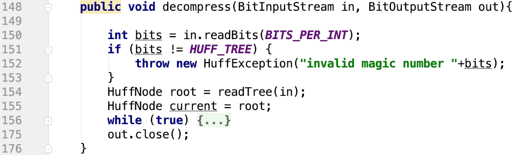
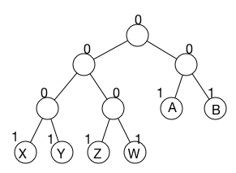
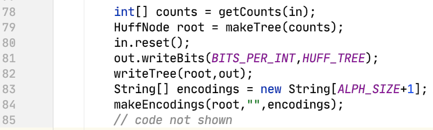

# Project 5: Huffman Coding/Compression

This is the directions document for Project 5 Huffman in CompSci 201 at Duke University, Spring 2023. [This document details the workflow](https://coursework.cs.duke.edu/cs-201-spring-23/resources-201/-/blob/main/projectWorkflow.md) for downloading the starter code for the project, updating your code on coursework using Git, and ultimately submitting to Gradescope for autograding.

For this project, **you are allowed to work with a partner** (that is, in a group of two). If you are working with a partner, you should start by reading the details in the expandable section below on how to collaborate effectively using Git. You will ultimately submit together on gradescope, with a single code and single analysis submission. Refer to [this document](https://docs.google.com/document/d/e/2PACX-1vREK5ajnfEAk3FKjkoKR1wFtVAAEN3hGYwNipZbcbBCnWodkY2UI1lp856fz0ZFbxQ3yLPkotZ0U1U1/pub) for submitting to Gradescope with a partner.  


<details>
<summary>Details on Git with a Partner for P4</summary>

You may find it helpful to begin by reading the Working Together section of the [Git tutorial](https://gitlab.oit.duke.edu/academic-technology/cct/-/tree/master/git) from the Duke Colab. For more, see the [Git tutoraial by Gitlab](https://docs.gitlab.com/ee/tutorials/make_your_first_git_commit.html) including the link to an [extensive video tutorial](https://www.youtube.com/watch?v=4lxvVj7wlZw) if you prefer that.

One person should fork the starter code and then add their partner as a collaborator on the project. Choose Settings>Members>Invite Members. Then use the autocomplete feature to invite your partner to the project as a *maintainer*. Both of you can now clone and push to this project. See the [gitlab documentation here](https://docs.gitlab.com/ee/user/project/members/).

Now you should be ready to clone the code to your local machines.

1. Both students should clone the same repository and import it into VS Code just like previous projects.  
2. After both students have cloned and imported, one person should make a change (you could just write a comment in the code, for example). Commit and push this change. 
3. The other partner will then issue a git pull request. Simply use the command-line (in the same project directory where you cloned the starter code for the project) and type:
```bash
git pull
```
4. If the other partner now opens the project in VS Code again, they should see the modified code with the edit created by the first partner. 
5. You can continue this workflow: Whenever one person finishes work on the project, they commit and push. Whenever anyone starts work on the project, they begin by downloading the current version from the shared online repository using a git pull command.

This process works as long as only one person is editing at a time, and **you always pull before editing** and remember to **commit/push when finished**. If you forget to pull before editing your local code, you might end up working from an old version of the code different than what is in the shared online gitlab repository. If that happens, you may experience an error when you attempt to push your code back to the shared online repository. 

There are many ways to resolve these conflicts, essentially you just need to pick which of the different versions of the code you want to go with. See the [working together Git tutorial](https://gitlab.oit.duke.edu/academic-technology/cct/-/blob/master/git/working_together.md) and the [branching and merging Git tutorial](https://gitlab.oit.duke.edu/academic-technology/cct/-/blob/master/git/branching_merging.md) from the Duke Colab for more information. You can also refer to our [Git troubleshooting document](https://coursework.cs.duke.edu/201-public-documentation/resources-201/-/blob/main/troubleshooting.md#git-faq). 

If you run into a merge conflict, one thing that might be confusing is that the editor that opens where you can resolve them may, by default, be [VIM](https://www.vim.org), which can be very unintuitive if you have not used it before. You can either look up the basics there, or if you prefer you can set a different text editor as the default that git uses for editing commit messages, merge conflicts, etc. For example, to make Visual Studio Code the default editor (this was an optional step we suggested during installation, so you may have already done this):
1. Open the command palette on visual studio code (`shift` + `command` + `p` on Mac, or `shift` + `ctrl` + `p` on Windows).
2. Write `Shell Command: Install 'Code' command in path` - it should autocomplete to this, press enter. It may ask for your permission.
3. In a terminal, enter the command `git config --global core.editor "code --wait"`. Now VS Code should be the default editor for git.
4. You can confirm the change by trying `git config --global -e` in a terminal. This should open a VS Code window showing your `git config` file (you don't need to edit, this is just to confirm it worked).

The `--wait` command means that whenever `git` opens something in VS Code for you to edit, it will wait until you close that window/tab before proceeding.


</details> 

## Outline 

- [Project Introduction](#project-introduction)
- [Part 0: Understanding and Running Starter Code](#part-0-understanding-and-running-starter-code)
- [Part 1: Implementing `HuffProcessor.decompress`](#part-1-implementing-huffprocessordecompress)
- [Part 2: Implementing `HuffProcessor.compress`](#part-2-implementing-huffprocessorcompress)
- [Analysis](#analysis)
- [Submitting and Grading](#submitting-and-grading)
- [Appendix: How the Tree in `decompress` was generated](#appendix-how-the-tree-in-decompress-was-generated)

## Project Introduction

There are many techniques used to compress digital data (that is, to represent it using less memory). This assignment covers Huffman Coding, which is used everywhere from zipping a folder to jpeg and mp3 encodings. You can optionally read more about the history of Huffman Coding and this project in the expandable section below.

<details>
<summary>Optional Background of Huffman</summary>
Huffman coding was invented by David Huffman while he was a graduate student at MIT in 1950 when given the option of a term paper or a final exam. For details, see [this 1991 Scientific American Article][Huffman Article]. In an autobiography Huffman had this to say about the epiphany that led to his invention of the coding method that bears his name:

"*-- but a week before the end of the term I seemed to have nothing to show for weeks of effort. I knew I'd better get busy fast, do the standard final, and forget the research problem. I remember, after breakfast that morning, throwing my research notes in the wastebasket. And at that very moment, I had a sense of sudden release, so that I could see a simple pattern in what I had been doing, that I hadn't been able to see at all until then. The result is the thing for which I'm probably best known: the Huffman Coding Procedure. I've had many breakthroughs since then, but never again all at once, like that. It was very exciting.*"

[The Wikipedia reference][Huffman Wikipedia] is extensive as is [this online material][Duke Huffman ] developed as one of the original [Nifty Assignments][Nifty Assignments]. Both jpeg and mp3 encodings use Huffman Coding as part of their compression algorithms. In this assignment you'll implement a complete program to compress and uncompress data using Huffman coding.

We first gave a Huffman coding assignment at Duke in Spring of 1994. Over the years many people have worked on creating the infrastructure for the bit-reading and -writing code (as we changed from C to C++ to Java at Duke) and the GUI that drives the Huffman assignment. It was one of the original so-called "nifty assignments" (see http://nifty.stanford.edu) in 1999. In Fall of 2018 we moved away from the GUI and using a simple main and the command-line. This was done for pragmatic and philosophical reasons.
</details>

**You should read about the Huffman algorithm, and work to understand it. You won't be able to complete the project easily without the overview you'll get from this reading: [Huffman algorithm reading and examples](https://www.cs.duke.edu/csed/poop/huff/info/).** You should be able to answer the questions provided in the expandable section below based on your reading and class/discussion. **Try to do so before beginning to code (but you do not need to turn in your answers).**

<details>
<summary>Pre-reading self-assessment questions</summary>

1. Why are two passes over the input file to be compressed required when creating a compressed version of the input file?
2. What aspects of creating the Huffman tree from counts account for that process being a greedy algorithm?
3. At a high-level, how is the tree used to create 8-bit char/chunk encodings?
4. What is written first, after the magic number, in the compressed file?
5. Why are the bits written at the end of the compressed file representing PSEUDO_EOF required?
6. After reading the magic number and tree, how are the bits representing compressed data read when decompressing, e.g., how many bits are read each time the compressed data is accessed?

</details>

When you've read the description of the algorithm and data structures used you'll be ready to implement both decompression (a.k.a. uncompressing) and compression  using Huffman Coding. You'll be using input and output or I/O classes that read and write 1 to many bits at a time, i.e., a single zero or one to several zeros and ones. This will make debugging your program a challenge.


## Part 0: Understanding and Running Starter Code

Once you understand the Huffman coding algorithm, you should review this section to understand the organization of the starter code.

### `BitInputStream` and `BitOutputStream` Classes

These two classes are provided to help in reading/writing bits in (un)compressed files. They extend the Java [InputStream](https://docs.oracle.com/javase/9/docs/api/java/io/InputStream.html) and [OutputStream](https://docs.oracle.com/javase/9/docs/api/java/io/OutputStream.html) classes, respectively. They function just like Scanner, except instead of reading in / writing out arbitrarily delimited “tokens”, they read/write a specified number of bits. Note that two consecutive calls to the `readBits` method will likely return different results since InputStream classes maintain an internal "cursor" or "pointer" to a spot in the stream from which to read -- and once read the bits won't be read again (unless the stream is reset).

The only methods you will need to interact with are the following:
1. *`int BitInputStream.readBits(int numBits)`*: This method reads from the source the specified number of bits and returns an integer. Since integers are 32-bit in Java, the parameter `numBits` must be between 1 and 32, inclusive. **It will return -1 if there are no more bits to read.**
2. `void BitInputStream.reset()`: This method repositions the “cursor” to the beginning of the input file.
3. `void BitOutputStream.writeBits(int numBits, int value)`: This method writes the least-significant `numBits` bits of the value to the output file.

### Running Starter Code (with incomplete `HuffProcessor.decompress`)

**Run `HuffMainDecompress`**. This prompts for a file to decompress, then calls `HuffProcessor.decompress`. You're given a stub version of that method; it initially ***simply copies the first file to another file***, it doesn’t actually decompress it. To make sure you know how to use this program, we recommend you run the program as described.

Choose `mystery.tif.hf` from the data folder to decompress (the `.hf` suffix indicates this has been compressed by a working `HuffProcessor.compress`). When prompted with a name for the file to save, use a `UHF prefix`, i.e., save with the name `UFHmystery.tif.uhf (that suffix is the default).  

Then run `diff` on the command line/terminal (details in the expandable section below). Use diff to compare two files: the original, `mystery.tif.hf` and the uncompressed version: `UHFmystery.tif.uhf`. The `diff` program should say these files are the same. This is because the code you first get from git simply copies the first file to another file, it doesn't actually decompress it. **You will use `diff` to check whether your implementation is working correctly locally, there are no JUnit tests for this project.**

The main takeaways here in running before implementing `HuffProcess.decompress` are to 
- Understand what to run when decompressing.
- Understand how to use `diff` on the command line to compare files. 

<details>
<summary>Expand for details on running diff at the terminal</summary>

There is a mac/unix command `diff` you can run in a terminal/bash shell on Mac/Windows (including the built-in terminal in VS Code). This command-line `diff`  compares two files and indicates if they are the same bit-for-bit or not. First you must navigate to the directory/folder containing the files you would like to compare. You can use the following commands to navigate directories in your terminal:

- `pwd` stands for "print working directory." Entering it will print the path to your current directory (the folder you are in).
- `ls` stands for "list subdirectories." Entering it will print all files and subfolders in your current folder. 
- `cd` stands for "change direcotory. Entering it, followed by a subfolder name, will navigate to that subfolder. For example, `cd Documents`. Entering `cd` with nothing after will navigate to your home directory. Entering `cd ..` will navigate to the enclosing directory (that is, will "back up one level" in the folder hierarchy).

Once you are in the same folder as the files you would like to compare, you can type (terminal/shell): `diff foo.txt bar.txt` to compare `foo.txt` and `bar.txt`.

If the files are the same _nothing is printed_. If the files are different there's an indication of where they are different for text files, and just `different` if the files are binary/compressed/image files. For your purposes in P5 it isn't especially crucial that you understand the output printed by `diff` - generally you will just want to check if a decompressed file is exactly same as the original file before any compression/decompression.

</details>

## Part 1: Implementing `HuffProcessor.decompress`

You should begin programming by implementing `decompress` first before moving on to `compress`. You'll remove the code you're given intially in `HuffProcessor.decompress` and implement code to actually compress as described in this section. You **must remember to close the output file** before `decompress` returns. The call `out.close` is in the code you're given, be sure it's in the code you write as well.

There are four conceptual steps in decompressing a file that has been compressed using Huffman coding:
1. Read the 32-bit "magic" number as a check on whether the file is Huffman-coded (see lines 150-153 below)
2. Read the tree used to decompress, this is the same tree that was used to compress, i.e., was written during compression (helper method call on line 154 below).
3. Read the bits from the compressed file and use them to traverse root-to-leaf paths, writing leaf values to the output file. Stop when finding `PSEUDO_EOF` (hidden while loop on lines 156-174 below).
4. Close the output file (line 175 below).

We recommend using the following code as a base for your decompress method because it illustrates how to use the bit-stream classes and how to throw appropriate exceptions. However, you will not be penalized if you use an alternative method to code it.

<details> 
<summary> Expand for example decompress outline </summary>

<div align="center">
  
</div>

To understand this in more detail, please review the explanation in the [Huffman coding writeup](https://www2.cs.duke.edu/csed/poop/huff/info/) -- in particular you'll need to know how the tree was written to write code that reads the tree.

</details>

As you can see in the example above, a `HuffException` is thrown if the file of compressed bits does not start with the 32-bit value `HUFF_TREE`. Your code should also throw a `HuffException` if reading bits ever fails, i.e., the `readBits` method returns -1. That could happen in the helper methods when reading the tree and when reading the compressed bits.


### Reading the Tree (private HuffNode readTree)

Reading the tree using a helper method is required since reading the tree, stored using a pre-order traversal, is much simpler with recursion. You don't have to use the names or parameters described above, though you can.
In the 201 Huffman tree protocol, interior tree nodes are indicated by the single bit 0 and leaf nodes are indicated by the single bit 1. No values are written for internal nodes and a 9-bit value is written for a leaf node. 

This leads to the following pseudocode to read the tree.

<details>
<summary> Expand for outline of readTree </summary>

``` java
private HuffNode readTree(BitInputStream in) {
bit = in.readBits(1);
if (bit == -1) throw exception
if (bit == 0) {
    left = readTree(...)
    right = readTree(...)
    return new HuffNode(0,0,left,right);
}
else {
    value = read BITS_PER_WORD+1 bits from input
    return new HuffNode(value,0,null,null);
    }
}
``` 

</details>

For example, the tree below corresponds to the bit sequence `0001X1Y01Z1W01A1B`, with each letter representing a 9-bit sequence to be stored in a leaf as shown in the tree to the right. You'll read these 9-bit chunks with an appropriate call of `readBits`. Rather than use 9, you should use `BITS_PER_WORD + 1`, the +1 is needed since one leaf stores `PSEUDO_EOF` so all leaf nodes store a 9-bit value. See the [appendix](#appendix-how-the-tree-in-decompress-was-generated) for a detailed explanation on how this tree was constructed.

<details> 
<summary> Expand for example tree </summary>

<div align="center">
  
</div>

</details>


### Reading Compressed Bits (while (true))

Once you've read the bit sequence representing the tree, you'll read the remaining bits from the `BitInputStream` representing the compressed file one bit at a time, traversing the tree from the root and going left or right depending on whether you read a zero or a one. This is represented in the pseudocode for `decompress` by the hidden while loop.

The pseudocode from the [Huffman coding writeup](https://www.cs.duke.edu/csed/poop/huff/info/)  is reproduced in the expandable section below, this is the same code shown in that document -- it's not perfect Java, hence pseudocode. (Note: you break when reaching `PSEUDO_EOF`, and then no bits are written to the output file. Otherwise, when writing a value stored in a leaf to the output stream, you write 8, or `BITS_PER_WORD` bits).

<details>
<summary> Expand for pseudocode example </summary>

``` java
  HuffNode current = root; 
  while (true) {
      int bits = input.readBits(1);
      if (bits == -1) {
          throw new HuffException("bad input, no PSEUDO_EOF");
      }
      else { 
          if (bits == 0) current = current.left;
          else current = current.right;

          if (current is a leaf node) {
              if (current.value == PSEUDO_EOF) 
                  break;   // out of loop
              else {
                  write BITS_PER_WORD bits to output for current.value;
                  current = root; // start back after leaf
              }
          }
      }
  }
  close output file
```

</details>


## Part 2: Implementing `HuffProcessor.compress`

There are five conceptual steps to compress a file using Huffman coding. You do not need to use helper methods for these steps, but for some steps helper methods are extremely useful and will facilitate debugging.

1. Determine the frequency of every eight-bit character/chunk in the file being compressed (see line 78 below).
2. From the frequencies, create the Huffman trie/tree used to create encodings (see line 79 below).
3. From the trie/tree, create the encodings for each eight-bit character chunk (see lines 83-84 below).
4. Write the magic number and the tree to the beginning/header of the compressed file (see lines 81-82 below).
5. Read the file again and write the encoding for each eight-bit chunk, followed by the encoding for PSEUDO_EOF, then close the file being written (not shown).

You won't need to throw exceptions for the steps outlined. A brief description of each step follows. More details can be found in the explanation of the Huffman algorithm in the [Huffman coding writeup](https://www.cs.duke.edu/csed/poop/huff/info/).

<div align="center">
  
</div>

### Determining Frequencies (private int[] getCounts)

Create an integer array that can store 256 values (use `ALPH_SIZE`). You'll read 8-bit characters/chunks, (using `BITS_PER_WORD` rather than 8), and use the read/8-bit value as an index into the array, incrementing the frequency. Conceptually this is a map from 8-bit chunk to frequency for that chunk, it's easy to use an array for this, mapping the index to the number of times the index occurs, e.g., `counts['a']` is the number of times 'a' occurs in the input file being compressed. The code you start with in compress (and decompress) illustrates how to read until the sentinel -1 is read to indicate there are no more bits in the input stream. 


### Making Huffman Trie/Tree (private HuffNode makeTree)

You'll use a greedy algorithm and a `PriorityQueue` of `HuffNode` objects to create the trie. Since `HuffNode` implements `Comparable` (using weight), the code you write will remove the minimal-weight nodes when `pq.remove()` is called as shown in the pseudocode included in the expandable section below.

<details>
<summary> Expand for makeTree pseudocode </summary>

``` java
PriorityQueue<HuffNode> pq = new PriorityQueue<>();
for(every index such that freq[index] > 0) {
    pq.add(new HuffNode(index,freq[index],null,null));
}
pq.add(new HuffNode(PSEUDO_EOF,1,null,null)); // account for PSEUDO_EOF having a single occurrence

while (pq.size() > 1) {
   HuffNode left = pq.remove();
   HuffNode right = pq.remove();
   // create new HuffNode t with weight from
   // left.weight+right.weight and left, right subtrees
   pq.add(t);
}
HuffNode root = pq.remove();
return root;
```

</details>

You'll need to ***be sure that `PSEUDO_EOF` is represented in the tree. *** As shown above, you should only add nodes to the priority queue for indexes/8-bit values that occur, i.e., that have non-zero weights.


### Make Codings from Trie/Tree (private makeEncodings)

For this, you'll essentially implement a recursive helper method, similar to code you've seen in discussion for the [LeafTrails APT problem](https://www2.cs.duke.edu/csed/newapt/leaftrails.html). As shown in the example of compress above, this method populates an array of Strings such that `encodings[val]` is the encoding of the 8-bit chunk val. See the debugging runs at the end of this write-up for details. As with the LeafTrails APT, the recursive helper method will have the array of encodings as one parameter, a node that's the root of a subtree as another parameter, and a string that's the path to that node as a string of zeros and ones. The first call of the helper method might be as shown, e.g., in the helper method `makeEncodings`.
``` java
    String[] encodings = new String[ALPH_SIZE + 1];
    makeEncodings(root,"",encodings);
```

In this method, if the `HuffNode` parameter is a leaf (recall that a leaf node has no left or right child), an encoding for the value stored in the leaf is added to the array, e.g.,
``` java
   if (root is leaf) {
        encodings[root.value] = path;
        return;
   }
```
If the root is not a leaf, you'll need to make recursive calls adding "0" to the path when making a recursive call on the left subtree and adding "1" to the path when making a recursive call on the right subtree. Every node in a Huffman tree has two children. ***Be sure that you only add a single "0" for left-call and a single "1" for right-call. Each recursive call has a String path that's one more character than the parameter passed, e.g., path + "0" and path + "1".***

### Writing the Tree (private void writeTree)

Writing the tree is similar to the code you wrote to read the tree when decompressing. If a node is an internal node, i.e., not a leaf, write a single bit of zero. Else, if the node is a leaf, write a single bit of one, followed by _nine bits_ of the value stored in the leaf.  This is a pre-order traversal: write one bit for the node, then make two recursive calls if the node is an internal node. No recursion is used for leaf nodes. You'll need to write 9 bits, or `BITS_PER_WORD + 1`, because there are 257 possible values including `PSEUDO_EOF`.

### Writing Compressed Bits

After writing the tree, you'll need to read the file being compressed one more time. As shown above, the ***`BitInputStream` is reset, then read again to compress it***. The first reading was to determine frequencies of every 8-bit chunk. The encoding for each 8-bit chunk read is stored in the array created when encodings were made from the tree. These encodings are stored as strings of zeros and ones, e..g., "010101110101". To convert such a string to a bit-sequence you can use `Integer.parseInt` specifying a radix, or base of two. For example, to write the encoding for the 8-bit chunk representing 'A', which has an ASCII value of 65, you'd use:
``` java
    String code = encoding['A']
    out.writeBits(code.length(), Integer.parseInt(code,2));
```
You'll use code like this for every 8-bit chunk read from the file being compressed. You must also write the bits that encode `PSEUDO_EOF`, i.e.,
``` java
    String code = encoding[PSEUDO_EOF]
    out.writeBits(code.length(), Integer.parseInt(code,2));
```
You'll write these bits _after_ writing the bits for every 8-bit chunk. The encoding for `PSEUDO_EOF` is used when decompressing, ***so you'll need to write the encoding bits before the output file is closed.***

## Analysis

You'll submit the analysis as a PDF separate from the code in Gradescope. If you are working with a partner, you and your partner should submit a single analysis document.

For the analysis questions, we will let $`N`$ be the number of total characters in a file to encode, and let $`M`$ be the total number of *unique* characters in the file. Note that both refer to the *non-compressed file*. Note that $`M \leq N`$. Define the *compression ratio* of a file to be the number of bits in the original file divided by the number of bits in the compressed file.

Note that running the `HuffMainCompress` and `HuffMainDecompress` programs will print information to the terminal about the number of bits and the runtime of the compress and decompress algorithms.

**Question 1.** Suppose you want to compress two different files: `fileA` and `fileB`. Both have $`N`$ total characters and $`M`$ unique characters. The characters in `fileA` follow a uniform distribution, meaning each of the unique characters appears $`N/M`$ times. In `fileB`, the $`i`$'th unique character appears $`2^i`$ times (and the numbers add up to $`N`$), so some characters are much more common than others. Which file should achieve a higher compression ratio? Explain your answer. 

**Question 2.** What is the asymptotic runtime complexity of `compress` as a function of $`N`$ and/or $`M`$? Explain your answer, referencing the algorithm / implementation. Be sure to account for all three parts of compression in your explanation: (1) determining counts of characters, (2) creating the Huffman coding tree, and (3) writing the encoded file.

**Question 3.** When running `decompress`, each character that is decompressed requires traversing at most $`M`$ nodes in the Huffman coding tree, and there are $`N`$ such characters. This analysis would at first suggest that the asymptotic runtime complexity of `decompress` is $`O(MN)`$. However, you are unlikely to experience this in practice; this estimate is too simple and pessimistic. To see why, answer the following examining two different extreme cases:
- First consider the case where, like `fileA` in question 1, every unique character appears $`N/M`$ times. Then what would the asymptotic runtime complexity of `decompress` be?
- Now consider the case like `fileB` where the $`i`$'th unique character appears $`2^i`$ times (and the numbers add up to $`N`$). Would the runtime complexity be better or worse than for `fileA`? You do not need to derive the asymptotic runtime complexity exactly, just compare to the answer for `fileA`. *Hint*: Recall your answer to question 1 and observe the relationship between the runtime complexity of `decompress` and the *number of bits* in the data being decompressed.

## Submitting and Grading

Push your code to Git. Do this often. To submit:

1. Submit your code on gradescope to the autograder. If you are working with a partner, refer to [this document](https://docs.google.com/document/d/e/2PACX-1vREK5ajnfEAk3FKjkoKR1wFtVAAEN3hGYwNipZbcbBCnWodkY2UI1lp856fz0ZFbxQ3yLPkotZ0U1U1/pub) for submitting to Gradescope with a partner. 
2. Submit a PDF to Gradescope in the separate Analysis assignment. Be sure to mark pages for the questions as explained in the [gradescope documentation here](https://help.gradescope.com/article/ccbpppziu9-student-submit-work#submitting_a_pdf). If you are working with a partner, you should submit a single document and [add your partner to your group on gradescope](https://help.gradescope.com/article/m5qz2xsnjy-student-add-group-members).

Points are awarded equally for compression and decompression. You'll get points for decompressing and compressing text and image files. These are 10 points each, for a total of 40 points possible on the code. The analysis is scored separately by TAs.

## Appendix: How the Tree in `decompress` was generated

<details>
<summary> Expand for appendix details </summary>

A 9-bit sequence represents a "character"/chunk stored in each leaf. This character/chunk, actually a value between 0-255, will be written to the output stream when uncompressing. One leaf stores PSEUDO_EOF, this won't be printed during uncompression, but will stop the process of reading bits.

<div align="center">
  
</div>

When you read the first 0, you know it's an internal node (it's a 0), you'll create an internall `HuffNode` node, and recursively read the left and right subtrees. The left subtree call will read the bits 001X1Y01Z1W as the left subtree of the root and the right subtree recursive call will read  01A1B as the right subtree. Note that in the bit-sequence representing the tree, a single bit of 0 and 1 differentiates INTERNAL nodes from LEAF nodes, not the left/right branch taken in uncompressing -- that comes later. The internal node that's the root of the left subtree of the overall root has its own left subtree of 01X1Y and a right subtree of 01Z1W. When you read the single 1-bit, your code will need to read 9-bits to obtain the value stored in the leaf.

</details>
